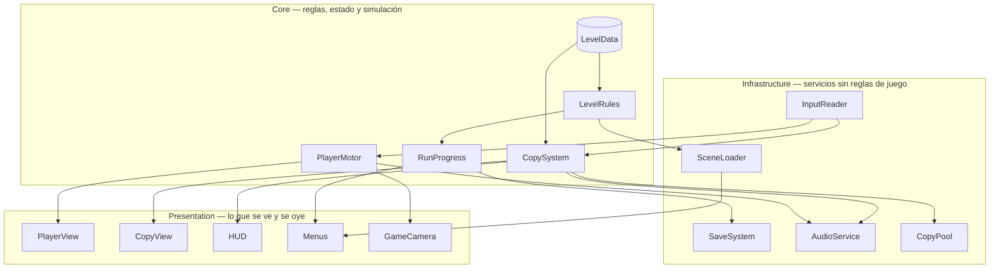

# GDD — Copia

Plataformero 2D de puzzles. El jugador coloca copias estáticas de sí mismo y las usa
como plataformas para alcanzar la meta de cada nivel.

- **Motor:** Godot 4.7 + GDScript tipado.
- **Escala:** portfolio (ver `CLAUDE.md`).
- **Destino:** Steam (publicación fuera del alcance de este documento).
- **Estado:** Fase 0 cerrada — 2026-09-16.

## Alcance cerrado

| Decisión | Valor |
|---|---|
| Niveles objetivo | 12, con punto de corte explícito en el 8 |
| Arte y audio | Assets CC0 / placeholder |
| Mecánica de copias | N limitado por nivel, colocables y borrables (última / todas) |
| Colocación | La copia nace a los pies del jugador y **lo deja parado encima**. Cada copia vale exactamente un piso de altura, se pueda saltar o no. Si no hay lugar arriba, no se coloca y no se gasta |
| Steam | Posterior. Este GDD cubre el juego, no la publicación |
| Time-loop / grabación de movimientos | **Descartado.** Es otro juego: exige determinismo, replay y sincronización |

---

## 1. Diagrama de sistemas

Los nodos van en inglés a propósito: son nombres de clases y escenas, y este diagrama
se reusa tal cual en el `README.md`, que va en inglés.

**Core** — lo único que decide qué es verdad en el juego:

- `PlayerMotor` — movimiento y colisión del jugador. Vive en Core porque el salto y la
  gravedad *son* las reglas de un plataformero, no una decoración.
- `CopySystem` — cuántas copias quedan, dónde se pueden colocar, cuál se borra.
- `LevelRules` — condición de victoria, muerte y reinicio. Separado de `CopySystem` para
  que agregar una segunda forma de ganar no toque las copias.
- `LevelData` — `Resource` (`.tres`) con los datos de cada nivel: límite de copias,
  escena, tiempo par. Es Core porque define reglas; es dato, no código.
- `RunProgress` — qué niveles completó el jugador. Estado del juego, no del disco.

**Infrastructure** — servicios que no saben nada del juego:

- `InputReader` — traduce teclas a *intenciones* (`jump`, `place_copy`). Aísla a Core del
  teclado real y habilita el remapeo futuro.
- `SceneLoader` — carga y descarga escenas de nivel. No sabe qué es ganar.
- `SaveSystem` — lee y escribe en `user://`. Recibe datos, no decide qué guardar.
- `AudioService` — reproduce sonidos por nombre.
- `CopyPool` — objetos reciclados en vez de creados y destruidos. **Entra solo si el
  Profiler lo justifica** (ver riesgos).

**Presentation** — lee estado de Core y lo dibuja. Nunca decide nada:
`PlayerView`, `CopyView`, `HUD`, `Menus`, `GameCamera`.

**Por qué tres capas.** Cuando se reemplacen los assets placeholder por arte propio,
solo se toca Presentation. Sin esta separación, cambiar un sprite obliga a abrir el
archivo que decide si ganaste el nivel.

---

## 2. Backlog

★ = complejidad (★ trivial → ★★★★ sistema grande).
Los sistemas terminados se marcan acá.

### P1 — sin esto no hay juego

- [x] **B1** — `PlayerMotor`: caminar, saltar, gravedad. ★★ — dep: — ✅ 2026-09-16
- [x] **B2** — `CopySystem`: colocar, borrar última, borrar todas, límite por nivel. ★★ — dep: B1 ✅ 2026-09-17
- [x] **B3** — `LevelRules`: meta → nivel completado → siguiente nivel; zonas de muerte;
  reinicio manual. ★★ — dep: B1 — spec `001-reglas-de-nivel` ✅ 2026-09-20
  📋 Creció respecto del plan original: absorbió el encadenado de niveles que estaba en
  B7, porque "completar un nivel" no tiene final observable sin él. Además incorporó las
  zonas de muerte, que no estaban en ningún ítem del backlog.
- [x] **B4** — `LevelData` como `Resource`. ★ — dep: B3 ✅ 2026-09-21
  📋 No se construyó como sistema propio: nació en B2 con `copy_limit` y B3 le sumó
  `next_level` y el dominio de `LevelRules` (D5). El tiempo par no está: su primer
  consumidor es B20 y un campo que nadie lee es decoración.
- [ ] **B5** — Un nivel greybox jugable de punta a punta. ★ — dep: B1–B4

### P2 — sin esto no es un producto

- [ ] **B6** — HUD: copias restantes. ★ — dep: B2
- [ ] **B7** — `SceneLoader`: carga asíncrona y transiciones. ★ — dep: B4
  📋 Reducido: el encadenado nivel → nivel se hace en B3. Acá queda lo que sobra —
  que la carga no congele el juego y que la transición no sea un corte seco.
- [ ] **B8** — Game feel: coyote time, input buffering, jump cut. ★★ — dep: B1
- [ ] **B9** — `GameCamera` con límites por nivel. ★ — dep: B5
- [ ] **B10** — Menú de título + pausa. ★★ — dep: B7
- [ ] **B11** — Diseñar y construir 12 niveles. ★★★ — dep: B5, B7, **B8**
- [ ] **B12** — Feedback de colocación inválida. ★★ — dep: B2, B6

### P3 — sin esto no se publica

- [ ] **B13** — `SaveSystem`: progreso persistente. ★★ — dep: B7
- [ ] **B14** — Audio: sfx de salto, colocar, borrar, victoria + música. ★★ — dep: B5
- [ ] **B15** — Selección de niveles. ★★ — dep: B13, B10
- [ ] **B16** — `CopyPool`. ★ — dep: B2 — **solo con número del Profiler que lo justifique**
- [ ] **B17** — Pulido: partículas de spawn, screenshake, hitstop. ★★ — dep: B12
- [ ] **B18** — Export a Windows/Linux + prueba en build release. ★★ — dep: B13

### P4 — después del release, o nunca

- [ ] **B19** — Mecánica secundaria (copias frágiles / móviles). ★★★ — dep: B11
- [ ] **B20** — Par times y contador de speedrun. ★★ — dep: B13
- [ ] **B21** — Remapeo de controles + gamepad. ★★ — dep: B7
- [ ] **B22** — Localización. ★★ — dep: B10

### Notas de priorización

- Ningún P1 depende de algo más abajo.
- **B8 antes que B11 es dependencia dura, no preferencia.** Diseñar niveles antes de
  congelar el salto obliga a rehacerlos con cada ajuste al movimiento.
- **B16 no se hace sin medición previa.** Con 3–5 copias por nivel, poolear no resuelve
  nada: es complejidad decorativa. Está listado solo para marcar dónde iría.

---

## 3. Estimación

Incluye, por escala portfolio: tests en la lógica pura (`CopySystem`, `LevelRules`),
commits limpios y `docs/perf/` cuando toque performance. Eso es ~15% del total.

| Bloque | Horas de trabajo efectivo |
|---|---|
| P1 (B1–B5) | 12 – 20 h |
| P2 sin B11 | 16 – 28 h |
| B11 — los 12 niveles | 20 – 45 h |
| P3 (B13–B18) | 16 – 30 h |
| **Total P1–P3** | **64 – 123 h** |

Supuestos:

- Assets placeholder CC0. Arte propio duplicaría el total como mínimo.
- Un solo verbo de mecánica. B19 queda fuera del número.
- ⚠️ **El más frágil: 1,5–3 h por nivel con playtesting.** El diseño de puzzles no escala
  lineal y los primeros tres niveles costarán el doble que el promedio.
  **Corrección barata:** cronometrar los niveles 1 a 3 y recalcular el bloque con ese dato.
- ⚠️ No incluye el tiempo de aprender Godot 4.7 mientras se construye: empíricamente
  20–40% extra.
- ❓ Sin dato de horas semanales disponibles, no hay traducción a calendario.

**Tensión con la escala declarada.** 12 niveles + Steam es alcance de producción chica,
no de portfolio. Para lo que se busca —que un lead abra el repo y vea sistemas de
gameplay bien programados— quince niveles no valen más que ocho: el código es el mismo
y el backlog solo crece del lado de producción de contenido.

**Decisión:** construir para 12 con punto de corte explícito en el 8. Si al llegar a 8 el
ritmo real no da, se cierra ahí y se publica un juego terminado de 8 niveles.

---

## 4. Riesgos

| Sistema / área | Impacto | Recomendación |
|---|---|---|
| **B11 diseño de niveles** | Alto — el ítem más caro y más incierto. Una sola mecánica se agota alrededor del nivel 8–10 | 3 niveles apenas B8 esté listo, y medir. Si a los 8 se siente repetido, ese dato justifica B19 — no antes |
| **`CopySystem`** | Alto — es el sistema que va a querer crecer sin control. Toda idea nueva aterriza acá | Congelar la interfaz: colocar, borrar-última, borrar-todo, contar. Las variantes entran como `LevelData` o `Resource` de comportamiento, nunca como un `if` nuevo adentro |
| ~~**Colisión copia-jugador**~~ | **Cerrado en B2.** Se resolvió eliminando la superposición en vez de gestionarla: el jugador queda parado sobre la copia al colocarla, así que nunca se solapan | Consecuencia de diseño a vigilar en B11: la altura alcanzable pasó a ser aritmética (N copias = N pisos). El límite por nivel es ahora la restricción principal del puzzle, no el salto |
| **Game feel (B8)** | Medio — si llega tarde, invalida niveles ya construidos | Dependencia dura antes de B11 |
| **Scope creep hacia time-loop** | Medio — idea tentadora que multiplica el proyecto | Ya descartado arriba. Si reaparece, va a P4 con el motivo escrito |
| **Performance** | Bajo — un 2D con 5 copias no tiene problema de performance | El riesgo real es el inverso: optimizar lo que no está lento. Ningún cambio por performance sin número previo |
| **Steam (fuera de alcance)** | Medio — página de tienda, capsules y trailer son trabajo real que no está en las 64–123 h | Cuando se acerque, es una Fase 0 propia |
| **Escala del proyecto** | Medio — el backlog empuja a producción, la escala declarada dice portfolio | El corte en el nivel 8. Si se sostienen los 12 firmes, actualizar la escala en `CLAUDE.md` |

---

## 5. Orden de ataque

Arranca por **B1 — `PlayerMotor`**.
