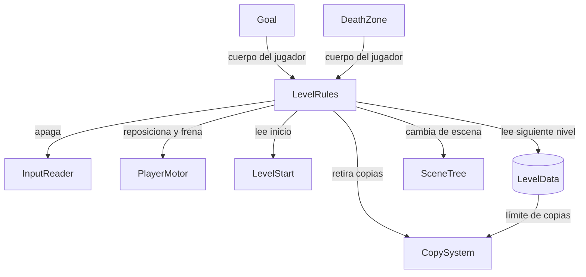

# 001 — Plan técnico

**Spec:** ./spec.md
**Escala del proyecto:** portfolio

## Enfoque

Un nodo `LevelRules` en cada escena de nivel es el único que sabe si el nivel está
ganado. Dos disparadores lo avisan —una meta y las zonas de muerte, ambas áreas que
detectan cuerpos— y él decide qué hacer: pasar al siguiente nivel o reiniciar el actual.
El reinicio no recarga la escena: devuelve al jugador al punto de partida, borra las
copias y restituye el contador, que es exactamente lo que piden R2.1 a R2.3. El input se
corta en un solo lugar, la capa `InputReader`, porque ya es el único camino por el que
el input entra al juego.

## Estructura

| Pieza | Responsabilidad | Lado |
|---|---|---|
| `LevelRules` (nuevo, `Node`) | Dueño del estado "completado". Orquesta reinicio y paso al siguiente nivel. Único que decide | Simulación |
| `Goal` (nuevo, `Area2D`) | Avisa que el cuerpo del jugador la tocó. No decide nada | Simulación |
| `DeathZone` (nuevo, `Area2D`) | Avisa que el cuerpo del jugador entró. No decide nada | Simulación |
| `LevelStart` (`Marker2D` en la escena) | Dato posicional: dónde arranca el jugador | Simulación |
| `LevelData` (existe, se amplía) | Suma el nivel siguiente al límite de copias que ya tenía | Datos |
| `PlayerMotor` (existe, se amplía) | Suma reposicionarse y frenar en seco al reiniciar | Simulación |
| `CopySystem` (existe) | Ya sabe retirar todas las copias. `LevelRules` reutiliza esa capacidad | Simulación |
| `InputReader` (existe, se amplía) | Suma poder estar apagado, lo que corta todo el input de una vez | Infraestructura |

Las dos áreas solo reportan; `LevelRules` es el único que decide. Es la separación que
permite que mañana una zona de muerte sea lava animada sin que la regla cambie.

## Datos

| Valor de la spec | Dónde vive | Por qué |
|---|---|---|
| Nivel siguiente (R1.5) | `LevelData.next_level: PackedScene` | Es propiedad del nivel, no del código. Encadenar niveles debe ser editar un `.tres` |
| Punto de inicio (R3.1) | Un `Marker2D` en la escena del nivel | Es una posición en el espacio: se coloca arrastrándola, no tipeando coordenadas |
| Zonas de muerte (R4.4) | Nodos `DeathZone` en la escena, cualquier cantidad | "Cualquier cantidad, incluida ninguna" es exactamente lo que da poner nodos en una escena |
| Límite de copias (R2.2) | `LevelData.copy_limit` — **ya existe** | Hecho en B2 |

Nada de esto es constante en código. No hay ningún número en esta feature: la spec no
tiene requisitos de tiempo ni de distancia, porque las reglas de nivel no son *feel*.

## Decisiones

### D1 — Cómo se corta el input al completar el nivel (R1.2)

- **Opciones:**
  - (a) Un interruptor en `InputReader`, que devuelve neutro cuando está apagado. ★
  - (b) `LevelRules` apaga el `_physics_process` de `PlayerMotor` y `CopySystem`. ★
  - (c) Un estado `FINISHED` nuevo en la máquina de estados del jugador. ★★
- **Elegida: (a).** R1.2 pide ignorar el *input*, no congelar la simulación. La (b) hace
  de más: detendría también la gravedad, y un jugador que toca la meta en el aire quedaría
  flotando — un comportamiento que la spec no pide y que nadie decidió. La (c) resuelve el
  jugador pero no las copias, así que haría falta igual otro mecanismo para `CopySystem`.
- **Descartada superior:** ninguna. La (c) es la más "correcta" en teoría y resulta la
  peor acá, porque el input que hay que cortar no es solo el del jugador.
- ⚠️SOLID **El costo, dicho de frente:** `InputReader` deja de no tener estado y pasa a
  tener un booleano estático, que es un singleton con otro nombre. Lo acepto porque es
  *un* dato, de solo lectura para todos menos `LevelRules`, y porque el motivo de haber
  construido esa capa era justamente tener un único punto de corte. Si algún día hay dos
  jugadores o un replay, este booleano es lo primero que se rompe.
- **Cuándo se revisaría:** al aparecer un segundo consumidor que necesite input mientras
  el juego está "congelado" — un menú de pausa, por ejemplo (B10).

### D2 — Reiniciar en caliente o recargar la escena (R2.1–R2.3)

- **Opciones:**
  - (a) Reset en caliente: reposicionar al jugador, retirar copias, anular velocidad. ★
  - (b) `get_tree().reload_current_scene()`. ★
- **Elegida: (a).** Los tres requisitos están escritos como tres acciones concretas, no
  como "volver a empezar". Y en un juego de puzzles el reinicio va a ocurrir muchas veces
  por minuto: recargar la escena entera en cada muerte es el tipo de atajo que después hay
  que deshacer, cuando aparezca un contador de intentos (B20) o una transición (B17) que
  deba sobrevivir al reinicio.
- **Descartada superior:** la (b) es *más barata y más segura*, y merece decirse: son tres
  líneas y es imposible olvidarse de resetear algo. El riesgo real de la (a) es
  precisamente ese — que dentro de seis meses haya estado nuevo que nadie acuerde limpiar.
- **Cuándo se revisaría:** si el reset en caliente acumula más de tres o cuatro cosas que
  limpiar, la (b) pasa a ser la opción correcta y hay que cambiar.

### D3 — Cómo se distingue el cuerpo del jugador de una copia (R1.6, R4.2)

- **Opciones:**
  - (a) Comparar el cuerpo recibido contra la referencia al jugador que ya está inyectada. ★
  - (b) Capas de colisión: que el motor de física filtre y las áreas ni vean las copias. ★
  - (c) Grupos (`is_in_group("player")`). ★
- **Elegida: (a).** Es explícita y no depende de configuración del editor que se pueda
  romper sin que nadie lo note. La (c) está fuera por los estándares del proyecto: un
  grupo usado como sustituto de una referencia es una búsqueda global disfrazada.
- **Descartada superior:** la (b). Es estrictamente mejor en rendimiento —el filtrado
  ocurre en el motor, la señal ni se emite— pero no hay ningún requisito de performance en
  esta spec, y compraría configuración de capas invisible en el código a cambio de un
  ahorro que nadie midió.
- **Cuándo se revisaría:** si un nivel llega a tener tantas copias y áreas que las señales
  ignoradas aparezcan en el Profiler. Ahí el número justifica la (b).

### D4 — Quién cambia de nivel y cuándo (R1.5)

- **Elegida:** `LevelRules` llama a `change_scene_to_packed()`, **diferido al final del
  frame**.
- **Por qué diferido:** las señales de `Area2D` se emiten durante el paso de física, y al
  cambiar de escena el nodo que hizo la llamada es parte de lo que se libera. Las docs de
  4.7 confirman que la escena vieja se elimina al final del frame, pero no prohíben la
  llamada desde una callback — ⚠️ así que esto es prudencia, no una regla citada. Si al
  probarlo la llamada directa funciona, sigue siendo la elección correcta: el costo de
  diferir es cero y el de equivocarse es un crash intermitente.
- **Descartada:** que `LevelRules` emita una señal y alguien más arriba cargue la escena.
  Hoy no existe ese "alguien" (B7 quedó reducido a carga asíncrona y transiciones) y
  crearlo para un único consumidor es la abstracción que el presupuesto de complejidad del
  proyecto no paga.

### D5 — Quién es dueño del `LevelData` del nivel

- **Elegida:** `LevelRules` lo tiene y se lo entrega a `CopySystem` al arrancar.
- **Por qué:** hoy `CopySystem` lo exporta por su cuenta. Si `LevelRules` también lo
  exportara, un nivel tendría dos casillas apuntando a recursos que pueden no ser el mismo,
  y ese desajuste no daría error: daría un nivel con reglas contradictorias.
- **Costo:** toca código ya escrito y probado de B2. Es un cambio chico, pero es cambio.
- **Cuándo se revisaría:** si aparece un sistema más que necesite `LevelData` y la cadena
  de entregas se vuelva más larga que el beneficio.

## Verificación

No hay suite de tests en el proyecto, así que todo se verifica corriendo la escena. Cada
grupo con su forma concreta:

| Requisitos | Cómo se comprueba |
|---|---|
| R1.1, R1.3, R1.4, R1.6 | Manual en escena. Tocar la meta con el cuerpo, con una copia, dos veces seguidas, y con copias sin gastar |
| R1.2 | Manual: al completar, ninguna tecla responde. Se observa que el jugador deja de reaccionar pero sigue cayendo |
| R1.5 | Manual: un segundo nivel de prueba y ver que se entra en él |
| R2.1–R2.3, R2.5 | Manual: reiniciar en el aire, con copias puestas, y verificar posición, contador y ausencia de velocidad heredada |
| R2.4 | Manual: reiniciar después de haber completado |
| R3.1, R3.2 | Manual: mover al jugador en el editor a otro lado y confirmar que igual arranca en el marcador |
| R4.1–R4.3 | Manual: caer en la zona, tirarle una copia, y tocar la meta y la zona a la vez |
| R4.4 | Manual: un nivel con dos zonas y un nivel sin ninguna |

Sin requisitos de performance en la spec, no hay nada que medir acá. Si al apilar copias
apareciera un problema de frame, el método está en `performance-medicion` y el número
manda antes que cualquier cambio.

## Riesgos

| Riesgo | Impacto | Qué haríamos |
|---|---|---|
| **El reset en caliente se olvida de algo** | Alto, y crece con el tiempo. Es el riesgo propio de D2: estado nuevo que nadie acuerde limpiar produce bugs que solo aparecen al segundo intento de un nivel | Concentrar todo el reinicio en un único método de `LevelRules`, para que el lugar donde agregar sea obvio. Si pasa de cuatro cosas, cambiar a recargar la escena |
| **Cambiar de escena desde una callback de física** | Alto si ocurre: crash intermitente, de los más difíciles de reproducir | Diferir la llamada. Ver D4 |
| **Encadenar niveles a mano se desordena** | Medio. Con doce niveles, `next_level` en cada `.tres` es una lista enlazada editada a mano: mover un nivel de lugar obliga a tocar dos archivos | Aceptable en doce niveles. Si duele, la lista de niveles pasa a ser un recurso único y `next_level` desaparece. Sería otra spec |
| **Quedar trabado sigue siendo posible** | Medio, de diseño. El reinicio manual lo resuelve para el jugador, pero un nivel donde trabarse sea fácil sigue siendo un mal nivel | Es material de B11, no de esta feature. Queda anotado |
| **El último nivel no tiene siguiente** | Bajo hoy, seguro más adelante. Es la pregunta abierta de la spec | Falla visible en desarrollo. Se resuelve cuando exista B10 |

## Nota

No se generó ningún requisito nuevo durante este plan. Lo único que se acerca es D5, que
cambia de lugar un dato existente sin alterar ningún comportamiento observable — es una
decisión técnica, no un requisito, y por eso vive acá y no en la spec.
