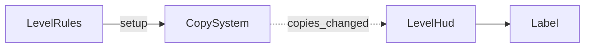

# 002 — Plan técnico

**Spec:** ./spec.md
**Escala del proyecto:** portfolio

## Enfoque

Una escena `hud.tscn` con un `CanvasLayer` y un `Label`, que se agrega a cada nivel como
un nodo más. El HUD recibe por el Inspector una referencia al `CopySystem` de su nivel, se
suscribe a `copies_changed(remaining, total)` y escribe el número que recibe. No calcula
nada, no guarda nada y no le habla a nadie: cada aviso trae el valor completo, así que no
existe la posibilidad de que el HUD se desincronice.

`CanvasLayer` es lo que resuelve R3.1 sin código: su contenido no se mueve con la cámara
del mundo, y ese es exactamente el requisito.

## Estructura

Piezas nuevas, las dos del lado de **presentación**:

| Pieza | Responsabilidad | Lado |
|---|---|---|
| `src/ui/hud.gd` (`class_name LevelHud`) | Suscribirse al contador y escribirlo. Nada más | Presentación |
| `src/ui/hud.tscn` | `CanvasLayer` → `MarginContainer` → `Label`. Posición, márgenes y tipografía se ajustan acá, no en código | Presentación |

Piezas que se tocan: **ninguna**. `CopySystem` ya emite `copies_changed` al colocar,
deshacer, borrar todo y en `setup()`, que es lo que R1.2, R1.3 y R1.4 necesitan. Este plan
no agrega ni una línea a simulación.

📋 Divergencia con el GDD: el diagrama lo llama `HUD`; acá se llama `LevelHud` para no
chocar con los menús de B10, que también son HUD en sentido amplio. El diagrama del GDD se
actualiza en el mismo commit que la implementación.

La flecha punteada es una señal: `CopySystem` no conoce a `LevelHud`. La dependencia de
código va en sentido contrario al dato — el HUD conoce al sistema de copias, nunca al
revés. Es la regla de capas del GDD y la nota que `/clarifica` sacó de los requisitos.

## Datos

- **Nada nuevo en `.tres`.** `copy_limit` ya vive en `LevelData` y el HUD lo recibe por la
  señal; no lo lee ni lo guarda.
- **`@export var copy_system: CopySystem`** — la referencia del nivel, puesta en el
  Inspector. Es el patrón del proyecto (igual que `LevelRules` con `goal` y `death_zones`)
  y lo que permite que R4.1 falle con un `assert`.
- **`@export var label_format: String = "%d"`** — el único valor afinable. Si probando
  resulta que un "3" desnudo no se entiende, se cambia a `"Copias: %d"` en el Inspector,
  sin tocar el script. La spec no fija el texto, y este es el tipo de valor que
  `sistemas-de-gameplay` manda exponer en vez de esconder en el código.
- Posición, márgenes, tamaño de fuente y color: propiedades de `hud.tscn`, se ajustan
  mirando. No son código.

## Decisiones

### D1 — El HUD vive dentro de cada nivel

- **Opciones:** (a) escena instanciada en cada nivel ★ · (b) HUD único que sobrevive al
  cambio de escena ★★ · (c) nodos sueltos copiados en cada nivel ★.
- **Elegida:** (a). Cero estado global: el HUD se conecta al `CopySystem` que tiene al
  lado y muere con el nivel. (c) queda descartada de entrada — 12 niveles copiando los
  mismos nodos significa cambiar la tipografía en 12 lugares.
- **Descartada superior:** (b) es mejor para B7 y B10, que van a querer un HUD que
  sobreviva a la transición y a la pausa. La descalifica que hoy tendría que enterarse de
  qué nivel se cargó y reconectarse en cada cambio — el mismo problema que la decisión del
  2026-09-20 resolvió con un dueño único, y `DECISIONES.md` ya rechazó un autoload con
  datos del nivel actual. Además el proyecto ya arrastra un ⚠️SOLID por el switch global
  de `InputReader`; sumar un segundo global agranda esa deuda en vez de pagarla.
- **Cuándo se revisaría:** cuando B7 muestre un parpadeo real del HUD entre niveles, o
  cuando B10 necesite el HUD vivo durante la pausa. Cualquiera de los dos lo justifica.
- **Va a `DECISIONES.md`:** sí. Condiciona a B7 y B10.

### D2 — El HUD se suscribe solo; nadie lo conecta

- **Opciones:** (a) `@export` al `CopySystem` + conexión propia ★ · (b) `LevelRules`
  conecta a ambos ★ · (c) EventBus autoload ★★.
- **Elegida:** (a). La dependencia queda donde tiene que estar: presentación conoce
  simulación, nunca al revés.
- **Descartada superior:** (b) es tentadora porque `LevelRules` ya es el punto de armado
  del nivel y ya reparte `LevelData`. La descalifica que obligaría a `LevelRules` —capa
  Core— a conocer un nodo de presentación, que es justo lo que el GDD prohíbe. (c) es lo
  que `godot-estandares` sugiere para desacoplar UI desde escala portfolio, pero el
  presupuesto de complejidad pide un segundo caso de uso **real y presente**: hoy hay un
  solo consumidor de eventos de UI.
- **Cuándo se revisaría:** con el segundo o tercer consumidor — B12 (feedback de
  colocación) y B14 (audio) son los candidatos. Ahí el EventBus empieza a pagarse.

### D3 — La suscripción se hace en `_enter_tree()`, no en `_ready()`

- **El problema:** R1.3 exige que al comenzar el nivel el HUD muestre el total. Esa primera
  emisión ocurre dentro de `LevelRules._ready()`, que llama a `CopySystem.setup()`. Si el
  HUD se conecta en su propio `_ready()`, llega a tiempo o no según dónde esté en el árbol
  respecto de `LevelRules` — y `copy_system.gd` ya documenta que el orden de `_ready()`
  entre hermanos no es algo en lo que apoyarse.
- **Opciones:** (a) conectar en `_enter_tree()` ★ · (b) conectar en `_ready()` y además
  pedir el valor actual con `call_deferred` ★ · (c) poner el HUD antes que `LevelRules` en
  el árbol y confiar en el orden ★.
- **Elegida:** (a). `_enter_tree()` se propaga de arriba hacia abajo antes de que corra
  ningún `_ready()`, así que la conexión existe antes que cualquier emisión, sin importar
  el orden entre hermanos. Se desconecta en `_exit_tree()`, como exige `godot-estandares`.
- **⚠️API — a confirmar antes de nada:** que un `@export var copy_system: CopySystem` ya
  esté resuelto cuando corre `_enter_tree()`. Es lo único de este plan que no se puede
  afirmar sin probarlo, y si resulta que no, la opción (a) no existe y se cae a (b). Por
  eso es la primera tarea.
- **Descartada:** (c) es la más barata y la más frágil: un nivel armado con los nodos en
  otro orden rompe R1.3 sin ningún error visible.
- **Apartarse de la convención del proyecto es deliberado.** `godot-estandares` dice
  conexiones en `_ready()`, y `_enter_tree()` solo para registro en sistemas globales. Acá
  la conexión tiene que preceder a una emisión que ocurre durante los `_ready()` ajenos,
  y esa es la excepción. Queda anotado para que no se lea como descuido.

### D4 — `CanvasLayer`, no un `Control` dentro del `Node2D`

- **Opciones:** (a) `CanvasLayer` ★ · (b) `Control` colgando del nodo raíz del nivel ★.
- **Elegida:** (a). R3.1 pide que el HUD no se mueva con la vista del nivel, y un
  `CanvasLayer` lo da por construcción: su contenido no lo afecta la `Camera2D`. Con (b),
  el HUD se desplazaría con el mundo en cuanto exista B9.
- **Cuándo se revisaría:** nunca por este requisito. Es la herramienta que el motor tiene
  para exactamente esto.

## Verificación

Sin suite de tests: todo lo de esta feature es presentación, y no queda ni una pieza de
lógica pura que se pueda probar sin `SceneTree`. Decirlo es más honesto que inventar un
test de un `Label`.

| Requisitos | Cómo se comprueba |
|---|---|
| R1.1, R1.5 | Correr `level_01`. El contador dice 3 al arrancar, 0 tras gastar las tres, y sigue en pantalla con el nivel completado |
| R1.2 | Colocar (**E**), deshacer (**Q**), borrar todo (**C**). El número cambia en el acto, sin tocar nada más |
| R1.3 | El valor al arrancar coincide con el `copy_limit` del `.tres`. **Es el criterio que D3 existe para sostener** |
| R1.4 | Gastar copias, reiniciar (**R**), el contador vuelve a 3 |
| R3.1 | ⚠️ Solo por construcción hoy: sin cámara (B9) no hay forma de observar que el HUD no se desplaza. Queda como verificación pendiente de B9, igual que R1.6 de la spec 001 quedó pendiente de la suite |
| R3.2 | Agrandar la ventana y cambiarle la proporción. Nada se corta |
| R4.1 | Vaciar la casilla `Copy System` en el Inspector y correr. Debe fallar con un mensaje que nombre qué falta |

Sin requisitos de performance: la spec no fija ninguno y el HUD se actualiza por evento.
Nada acá entra en `_process`, así que no hay número que medir ni presupuesto que declarar.

## Riesgos

| Riesgo | Qué haríamos |
|---|---|
| ⚠️ **El `@export` de nodo no está resuelto en `_enter_tree()`** y D3 se cae | Plan B ya elegido: conectar en `_ready()` y pedir el valor actual con `call_deferred`. Cuesta un frame con el contador vacío. Se verifica en la primera tarea, antes de escribir el resto |
| **R3.1 no es verificable hasta B9** | Se declara pendiente en la spec, como se hizo con R1.6 de la 001. No se finge que está probado |
| **Diseño: un "3" sin contexto no se entiende** | Por eso `label_format` es `@export`. Si probando no se entiende, se le pone etiqueta sin tocar código. La spec dejó los controles en pantalla fuera de alcance, pero este riesgo es real y el ajuste es barato |
| **Diseño: el HUD se recrea en cada cambio de nivel** | Consecuencia aceptada de D1. Si B7 muestra parpadeo, D1 se revisa — está escrito ahí |
| **Deuda que este plan NO paga:** `completed` sigue sin consumidor | Declarado en la spec. Lo resuelve B7. No se disimula acá |

## Requisitos nuevos que aparecieron

Ninguno. El plan se cubre entero con los 8 requisitos vivos de la spec —R1.1 a R1.5, R3.1,
R3.2 y R4.1—; no hizo falta inventar comportamiento para que cerrara.
